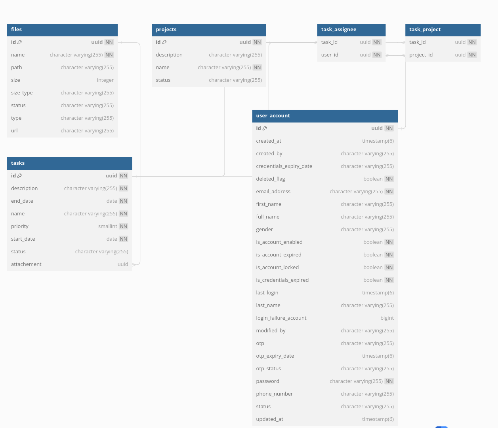
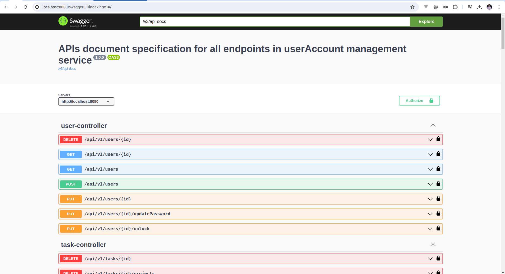
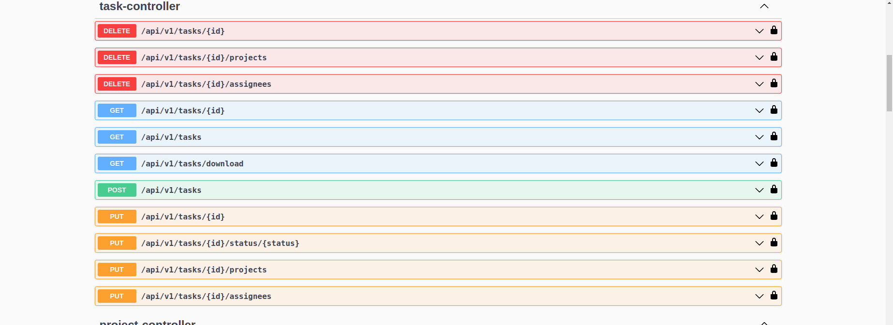
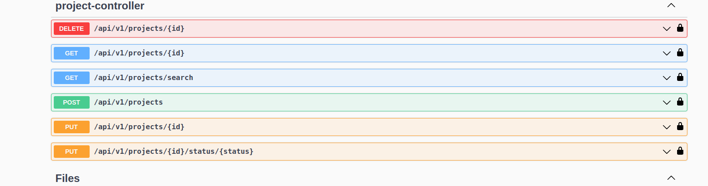
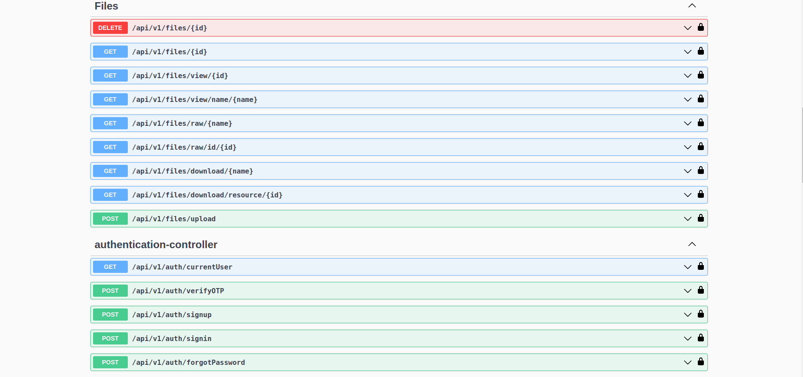
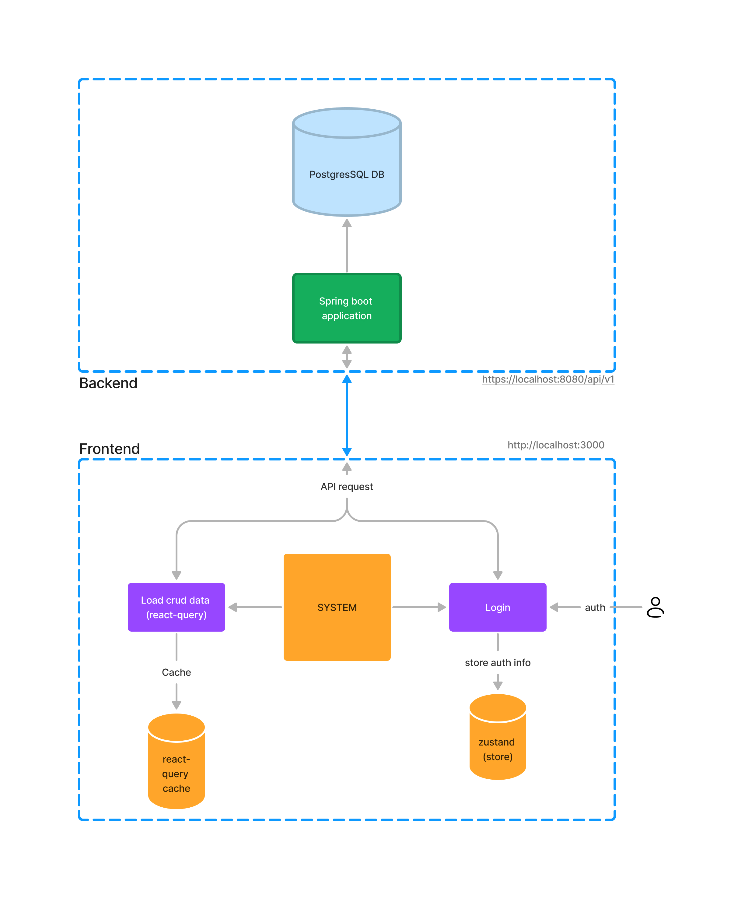

# USER TASK MANAGEMENT SYSTEM

## Description

This is a simple user and task  management system which allows user to create  create, edit, delete and updating the progress of the task
as completed or incompleted and also mark the priority of the task as Low, Normal or High in the end all this information are stored in database
in which app allows user to view task into paginated table with filters and sorting basing on columns.

## ERD

## SwaggerUI

## Architecture

## Documentation

- [Backend](qt-task-mis-backend/README.md)
- [Frontend](qt-task-mis-frontend/README.md)

